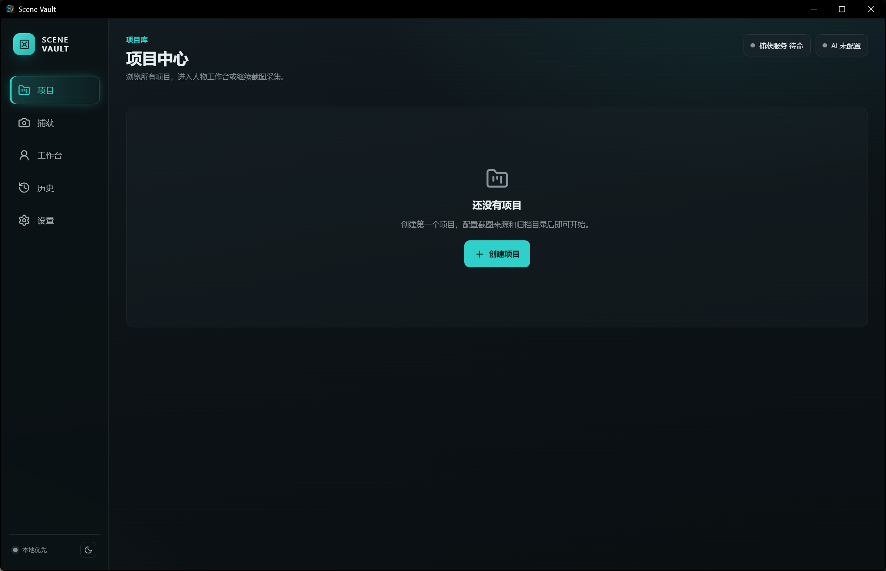
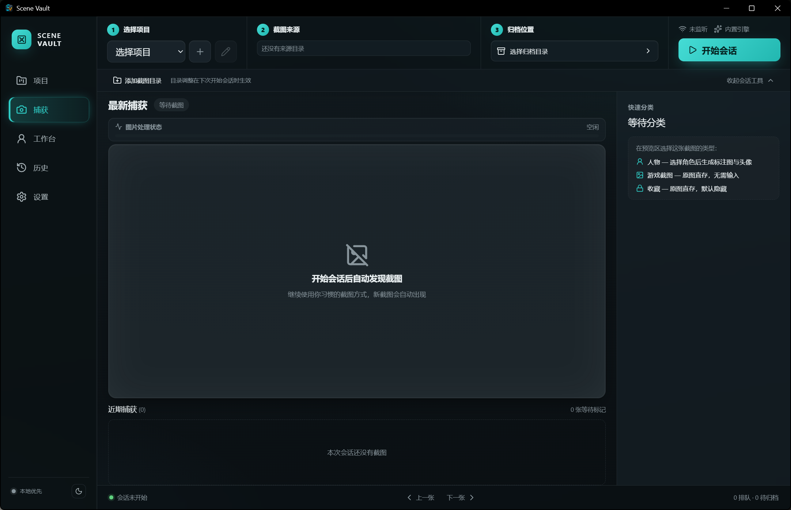
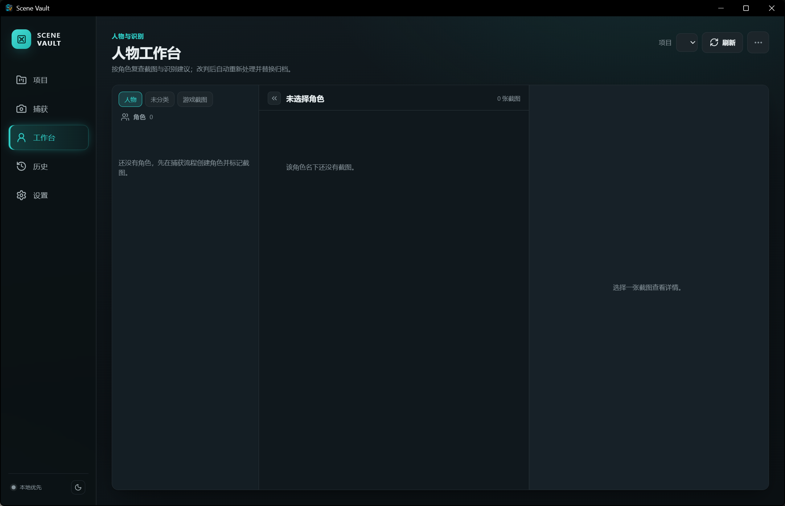
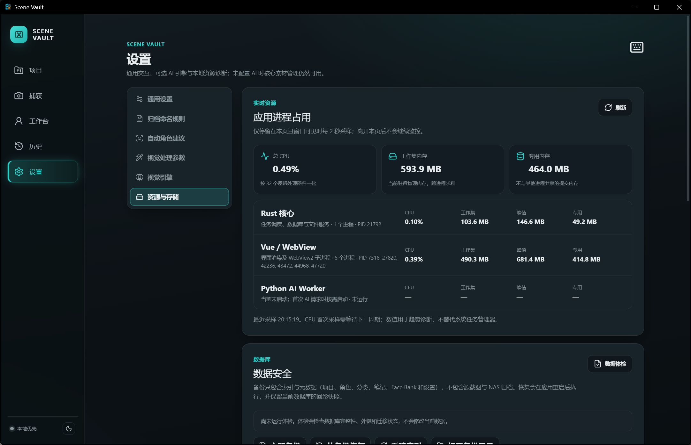
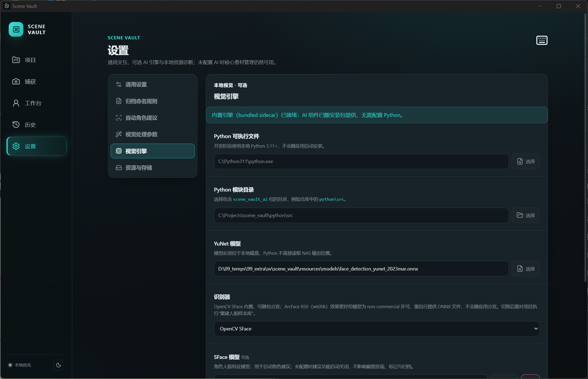
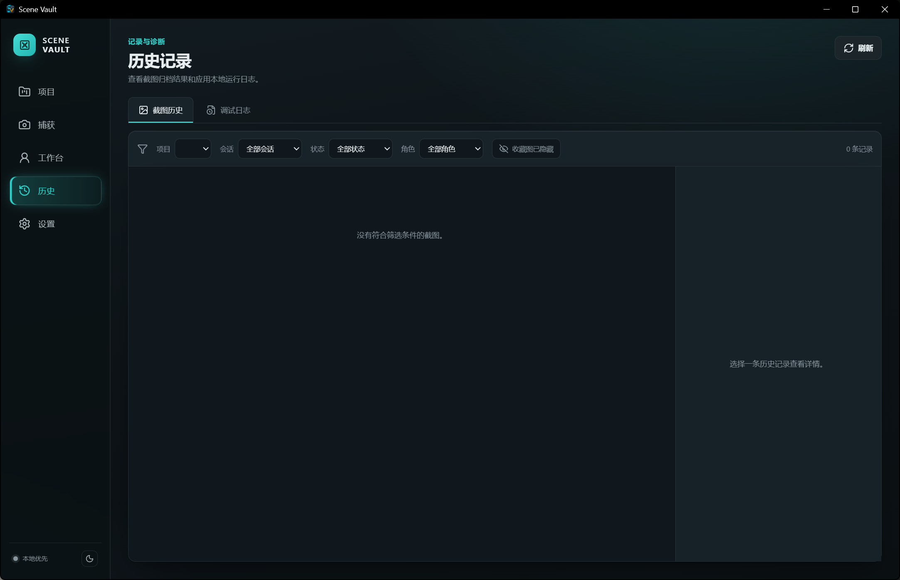

# Scene Vault

[English](docs/README.en.md) | 简体中文

Scene Vault 是面向各类游戏的 **Windows 本地优先**截图管理与创作辅助桌面应用，基于
Tauri 2、Rust、Vue 3 与 SQLite 构建。可选的本地 Python 视觉引擎提供人脸检测、
角色名标注、头像裁剪与 Face Bank 角色建议。

## 设计原则

- **本地优先**：截图与资料保存在你自己的磁盘；数据库只存索引与业务关系，绝不擅自
  移动或上传文件。没有网络、没有 AI 引擎时，发现、分类、索引与归档依然完整可用。
- **通用采集**：监听一个或多个游戏截图目录，识别稳定写入的新图片，完成人工分类与
  角色标记，可靠归档到本地目录或 NAS 共享。不绑定特定游戏、引擎或截图工具。
- **AI 可选、可替换**：识别引擎以独立进程运行（开发态为系统 Python，发布版内嵌为
  sidecar），模型与运行方式可替换；ArcFace 权重由用户自备，不随包分发。

> OCR、图片描述、通用自动标签、Embedding、语义搜索与 RAG 为后续路线图能力，
> 当前未实现。

## 安装

**系统要求**：Windows 10/11 x64（需 WebView2 运行时——Win11 预装，Win10 随 Edge
提供，应用安装时会自动补装）。无需 Node、Rust 或 Python。

从 [Releases](https://github.com/awillheartwu/scene_vault/releases) 下载安装包：

| 安装包 | 内容 | 体积 |
|---|---|---|
| `scene-vault-1.0.0-ai-setup.exe` | 应用 + 内置 AI 引擎（YuNet/SFace/中文标注字体） | ~110 MB |
| `scene-vault-1.0.0-setup.exe` | 仅应用（AI 引擎按需另行启用） | ~6 MB |

**快速开始**：安装并启动 → 新建项目 → 添加**截图源目录**（游戏截图存放处）与
**归档目录**（本地文件夹或 NAS `\\...` 共享）→ 开始会话 → 截图自动发现与登记；
“导入截图”可批量登记目录中已有的旧图。标记为“人物”后，AI 引擎会自动给出角色
建议（低置信度仍由你人工确认）；未分类/游戏截图/收藏等分类保持人工语义。

## 界面预览

> 截图位于 `docs/screenshots/`（示例项目截图，不含敏感内容）。

| 页面 | 截图 |
|---|---|
| 项目总览（Home） |  |
| 捕获页（Capture） |  |
| 人物工作台（Workbench） |  |
| 设置：数据安全 |  |
| 设置：视觉引擎 |  |
| 历史页（History） |  |

## 核心特性

- **截图采集**：多源目录监听、内容哈希去重（相同截图只登记一次）、稳定写入判定、
  会话中途新增目录自动挂载、断点与重试恢复
- **分类与角色**：人物/游戏截图/收藏/待分类、角色标记与重命名/合并/代表头像、
  快捷分类弹窗（全局快捷键）
- **可选 AI**：人脸检测、Face Bank 角色建议、标注图与头像生成、SFace/ArcFace 切换
- **可靠归档**：本地或 NAS、原子写入、失败自动重试退避、NAS 断线不丢数据
- **数据安全**：完整性预检、一致性备份（SHA-256 清单）、两阶段恢复与失败回滚、
  数据库打不开时的最小恢复界面、迁移前自动备份
- **规模**：1.0 守门为单项目 1 万张截图 / 1 万文件源目录 / 100 角色；列表服务端分页
- **日志与诊断**：结构化本地日志、设置页资源与引擎状态面板、数据体检与索引维护

## 从源码构建

### 前端与测试

```powershell
pnpm install
npx vitest run          # 前端测试
pnpm build              # 类型检查 + 生产构建
start-tauri-dev.bat     # 开发模式（vite + cargo run）
```

### Rust 后端

```powershell
cargo test --manifest-path src-tauri/Cargo.toml
```

### Python 引擎（可选）

```powershell
$env:PYTHONPATH = "python/src"
python -m unittest discover -s python/tests
python -m scene_vault_ai health
```

### Windows 发布包

`scripts/release-windows.ps1` 一键构建两个 NSIS 安装包：前端构建 → PyInstaller
sidecar → 模型/字体打包 → NSIS 出包。常用参数：`-SkipAI`（只出小包）、
`-AffinityMask`（限核，13900K 等机器建议 0xF）、`-SignCertificatePath`（可选签名）。
GitHub Actions（`.github/workflows/release-windows.yml`）在推送 `v*` 标签时自动
构建并把安装包挂到 Release。

环境配置与 Windows 一键安装脚本见[开发指南](docs/DEVELOPMENT.md)。

## 仓库结构

```text
src/                 Vue 前端
src-tauri/           Tauri/Rust 后端、SQLite 迁移与打包配置
python/              可选的本地 AI 引擎（版本化 JSON 协议）
scripts/             开发与发布脚本
docs/                产品、架构、决策、验收与开发文档
AGENTS.md             AI Agent 工作约束
```

## 文档

- [项目背景](docs/PROJECT_CONTEXT.md)
- [系统架构](docs/ARCHITECTURE.md)
- [数据模型](docs/DATA_MODEL.md)
- [Capture Session 工作流（含 Windows 实机验收清单）](docs/CAPTURE_WORKFLOW.md)
- [人脸识别基准测试](docs/BENCHMARK.md)
- [资源与存储说明](docs/RESOURCE_USAGE.md)
- [开发指南](docs/DEVELOPMENT.md)
- [开发路线图](docs/ROADMAP.md)
- [技术决策记录](docs/decisions/)
- [Python AI 协议](python/README.md)

## 数据与许可

- 数据库与用户数据位于 Tauri 应用数据目录（`%APPDATA%` / `%LOCALAPPDATA%` 下），
  不随仓库或素材目录存放；卸载应用不会删除用户数据。
- 随包标注字体（得意黑）为 SIL OFL-1.1 许可；YuNet/SFace 模型来自 opencv_zoo。
- ArcFace 权重（`w600k_r50.onnx`）为 non-commercial 许可，由用户自行提供，应用
  不随包分发；未提供时自动回退内置 SFace。

## 常见问题

- **AI 建议总是不出现？** 先确认设置页“视觉引擎”显示“内置引擎已就绪”；再确认
  截图里能检测到人脸（无脸/过小脸会明确提示且不入样本库）。动漫/游戏立绘脸的
  相似度普遍偏低，阈值 0.5 时可能无建议——可在“识别建议设置”中降低置信度阈值，
  或切换到 ArcFace（效果更好但需要自备权重）。
- **切换识别器后新截图没有建议？** 切换后需在项目里“重建人脸样本库”，待分类图会
  自动按新模型重新提取特征；已标记人物图的重建由样本库重建完成。
- **首次触发 AI 有点慢？** 内置引擎为单文件自解压程序，首次调用需几秒解压；之后
  常驻 worker 复用模型，恢复正常速度。
- **安装时提示“未知发布者”？** 安装包暂未代码签名，Windows SmartScreen 会提示，
  点“更多信息 → 仍要运行”即可；不影响功能。
- **如何把安装包分享给别人？** 直接分发两个安装包即可，目标机器无需安装
  Node/Rust/Python；私有仓库的 Release 链接只有成员可见，可用 Forgejo Release 或
  网盘托管。
- **数据备份在哪？** 设置 → 资源与存储 → 数据安全：一键预检、备份（SHA-256 清单）、
  恢复（两阶段 + 失败回滚）与索引维护；数据库损坏时应用会自动进入最小恢复界面。
